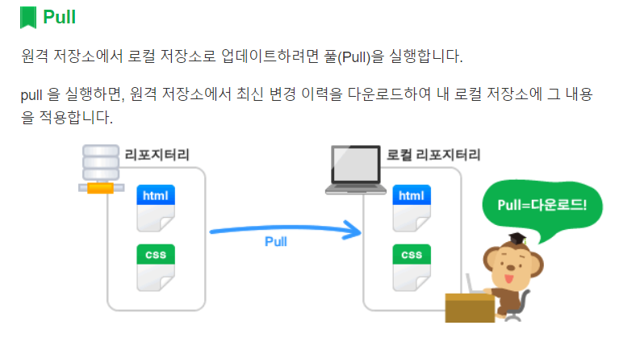

## PULL과 CLONE의 차이
* clone은 전체 프로젝트를 복제해오는것이고

* pull은 변경사항만 remote repository에서 갖고와서 적용하는것이다.

[위 사진은 인텔리제이 view에서는 안보이는데, github에서는 잘보인다.]

*****
<https://backlog.com/git-tutorial/kr/stepup/stepup3_1.html>
에 잘 나와있다.